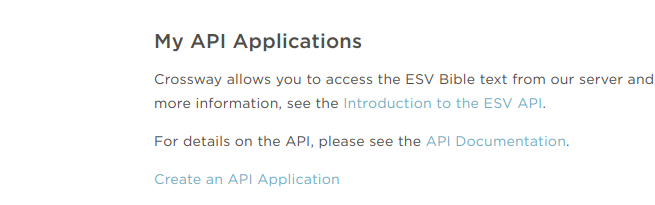
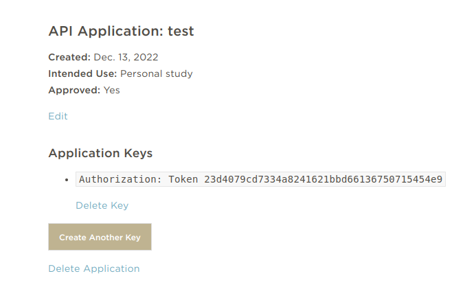
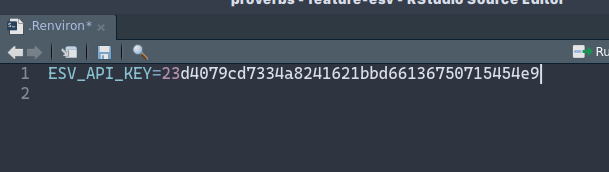
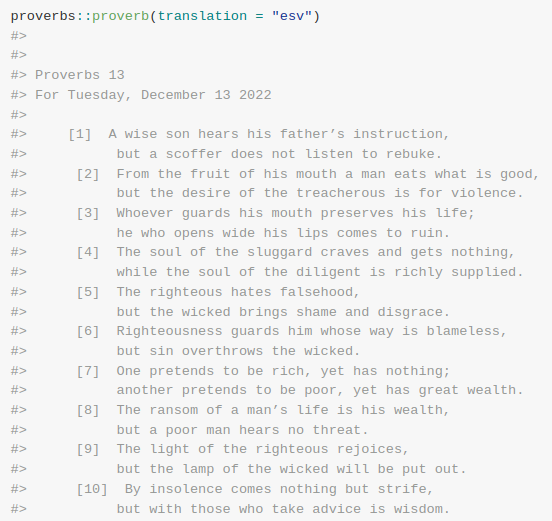

```{r, include = FALSE}
knitr::opts_chunk$set(
  collapse = TRUE,
  comment = "#>"
)
```

```{r setup}
library(proverbs)
```

Certain bible translations are hidden behind an API key-wall, such as the [ESV - English Standard Version](https://www.esv.org/). You can access the ESV version of your daily proverb after you obtain a free API key from the ESV website. Here are the steps; takes about 5 minutes.

## Create an account

Go to <https://www.esv.org/> and sign up for a free account.

## Create an API application

Navigate to <https://api.esv.org/account/> and click on **Create an API application:**



Check a few boxes and you'll see a token like this:



Copy the token after **Token** and keep it handy.

## Set the environmental variable in RStudio

Assuming you're using RStudio, enter this token in a special environmental variable.

```{r eval=FALSE}
usethis::edit_r_environ()
```



## Restart

Restart your RStudio session and you should be able to view the ESV version


